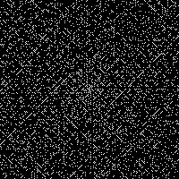

# primes [![License][licenseImg]][licenseLink] [![Maven][mavenImg]][mavenLink]

Playing with primes using scala language. Draw Ulam spiral, ...

To generate a 1000x1000 ulam spiral use : 
```
$ sbt "run 1000"
```
It will generate a PNG image file named "ulam-spiral-500.png"



To starts the console and play with primes :
```
$ sbt console"

scala> val ngen = new PrimesGenerator[Long]
ngen: fr.janalyse.primes.PrimesGenerator[Long] = fr.janalyse.primes.PrimesGenerator@27313524

scala> import ngen._
import ngen._

scala> primes.to(LazyList)(500)
res0: Long = 3581

scala> primes.take(15).toList
res1: List[Long] = List(2, 3, 5, 7, 11, 13, 17, 19, 23, 29, 31, 37, 41, 43, 47)

scala> sexyPrimes.take(5).toList
res2: List[Long] = List(5, 7, 11, 13, 17)

scala> isolatedPrimes.take(10).toList
res3: List[Long] = List(23, 37, 47, 53, 67, 79, 83, 89, 97, 113)

scala> checkedValues.filter(_.isPrime).find(_.nth==100000)
res4: Option[fr.janalyse.primes.CheckedValue[Long]] = Some(CheckedValue(1299709,true,100000))

scala> checkedValues.filter(_.isPrime).to(LazyList)(0)
res5: fr.janalyse.primes.CheckedValue[Long] = CheckedValue(2,true,1)

scala> checkedValues.filter(_.isPrime).to(LazyList)(99)
res6: fr.janalyse.primes.CheckedValue[Long] = CheckedValue(541,true,100)

scala> checkedValues.filter(!_.isPrime).drop(1000).take(10).mkString("\n")
res7: String = 
CheckedValue(1198,false,1001)
CheckedValue(1199,false,1002)
CheckedValue(1200,false,1003)
CheckedValue(1202,false,1004)
CheckedValue(1203,false,1005)
CheckedValue(1204,false,1006)
CheckedValue(1205,false,1007)
CheckedValue(1206,false,1008)
CheckedValue(1207,false,1009)
CheckedValue(1208,false,1010)

scala> checkedValues.filter(_.isPrime).drop(10000).take(10).mkString("\n")
res8: String = 
CheckedValue(104743,true,10001)
CheckedValue(104759,true,10002)
CheckedValue(104761,true,10003)
CheckedValue(104773,true,10004)
CheckedValue(104779,true,10005)
CheckedValue(104789,true,10006)
CheckedValue(104801,true,10007)
CheckedValue(104803,true,10008)
CheckedValue(104827,true,10009)
CheckedValue(104831,true,10010)

scala> mersennePrimes.take(8).toList
res6: List[Long] = List(3, 7, 31, 127, 8191, 131071, 524287, 2147483647)
  (for mersenne primes, switch to BigInt...)

scala> val dp = new PrimesDefinitions[BigInt]()
scala> dp.eratosthenesSieve(100).last
res0: fr.janalyse.primes.CheckedValue[BigInt] = CheckedValue(100,false,3,74)

scala> ulamSpiralToPngFile(500, checkedValues, "ulam-spiral.png")

scala> sacksInspiredSpiralToPngFile(500, 3, checkedValues, "ulam-sacks-like.png")

  
```

and so one...

[mavenImg]: https://img.shields.io/maven-central/v/fr.janalyse/primes_2.13.svg
[mavenLink]: https://search.maven.org/#search%7Cga%7C1%7Cfr.janalyse.primes

[licenseImg]: https://img.shields.io/github/license/dacr/primes.svg
[licenseLink]: https://www.apache.org/licenses/LICENSE-2.0.txt
